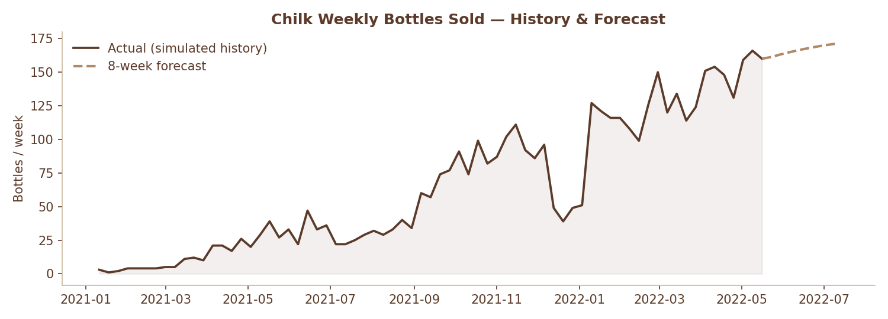
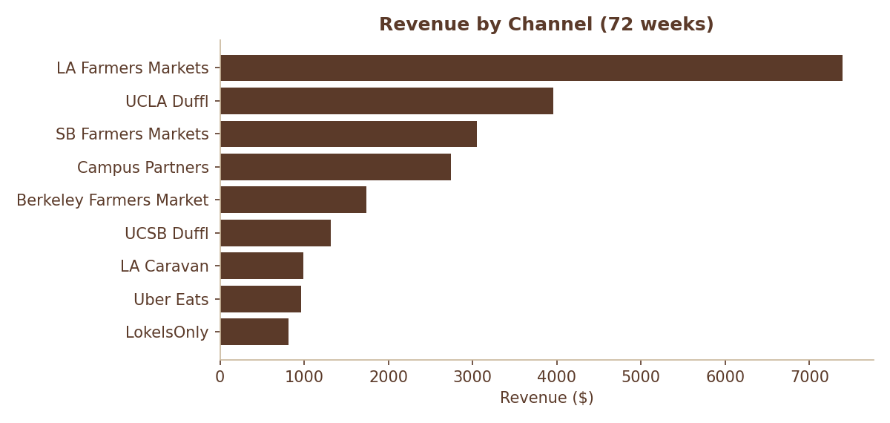
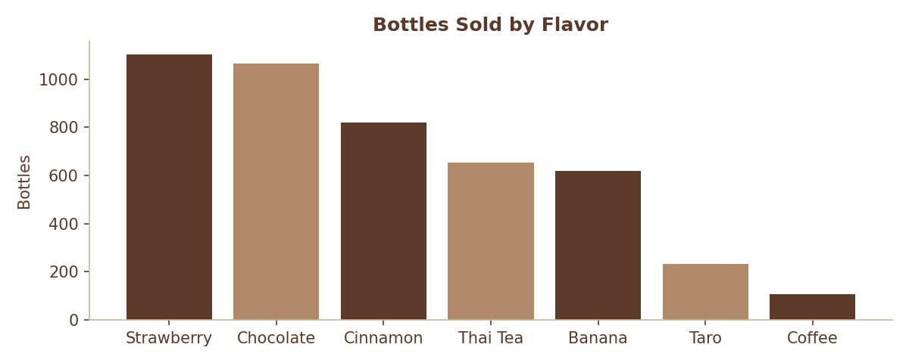

# Chilk — Inventory Planning & Demand Forecasting Model

An Excel-based materials requirements planning (MRP) tool with a Python data pipeline, rebuilt from the operational inventory tracker I created and ran as **COO of Chilk**, a plant-based milk startup (2021–2022).



## The business problem

Chilk produced bottled oat-milk drinks in seven flavors, sold through LA/SB/Berkeley farmers markets, Duffl campus delivery, fraternity campus partners, and a mobile caravan. As COO I owned logistics and operations, which meant answering the same question every two weeks: **given what we expect to sell, exactly what do we need to order, from whom, and by when?**

The constraints that made this hard:

- Most shelf-stable ingredients had a **21-day supplier lead time**, so ordering had to happen three weeks before production.
- Fresh ingredients (bananas, strawberries, taro) spoil in ~7 days and had to be ordered within days of an event.
- Ingredients ship in fixed pack sizes (e.g., oat milk base in 192 oz cases, guar gum in 16 oz jars), so requirements had to be rounded up to whole packs.
- Cash was tight — over-ordering tied up money, under-ordering meant missed sales.

I originally solved this with a single-sheet Excel calculator built before I knew how to code. It worked — we ran real purchasing off it — but it mixed inputs, formulas, and notes in one sheet, had hardcoded values, and forecasting was "look at the calendar and guess."

## What this rebuild does

**`Chilk_Inventory_Planner.xlsx`** — the planning workbook:

| Sheet | Purpose |
|---|---|
| README | Instructions, data notes, color key |
| Dashboard | KPIs (planned bottles, revenue, order cost, waste rate, alerts) + charts |
| Sales History | 72 weeks of weekly bottles sold by flavor, with trend chart |
| Channel Insights | Revenue, share, waste rate, and sell-through by channel — computed live from the raw data with SUMIFS |
| Forecast | 8-week demand forecast per flavor, safety stock recommendations, and an 8-week holdout backtest (MAPE) |
| Production Plan | Inputs: production date and planned bottles per flavor (defaults = forecast + safety stock) |
| Order Plan | The buy list: net requirements, whole-pack order quantities, cost, supplier, order-by dates, and LATE/ORDER/OK status flags |
| Sales Data | Raw transaction-level table (1,800 rows) with autofilter — the source for all channel analytics |

The workbook follows financial-modeling conventions: blue = inputs, black = formulas, green = cross-sheet links, conditional formatting for action items, zero hardcoded calculations.

**`pipeline/`** — Python scripts that feed the workbook:

1. `generate_sales_history.py` — builds a simulated but calibrated weekly sales history (see data note below)
2. `forecast_demand.py` — Holt damped-trend exponential smoothing per flavor, 8-week horizon, plus safety stock sized as *z·σ·√(lead time)* at a 95% service level, and an 8-week holdout backtest
3. `build_workbook.py` — regenerates the entire Excel model from the CSVs
4. `make_charts.py` — renders the README charts

Rerun in that order to refresh everything: `pip install -r pipeline/requirements.txt`, then run each script.

## Key findings

- **Farmers markets carried the business** — LA alone drove the largest revenue share, and the three farmers-market channels together account for roughly half of all revenue.



- **Waste concentrated where demand was hardest to predict.** Sell-through by channel exposes where over-delivery happened — exactly the problem the forecast + safety-stock model is designed to reduce.
- **The forecast holds up out of sample.** Trained on all but the final 8 weeks, the model's mean absolute percentage error across flavors is ~9%, with the largest misses on flavors still in their growth ramp (the damped trend deliberately under-extrapolates growth — a conservative bias that suits a cash-constrained startup).
- **Demand followed the academic calendar** — visible winter-break collapses and spring peaks, which is why the planner defaults to forecast + safety stock rather than a simple average.



## Data provenance

- **Real:** all ingredient data — recipes (per-bottle usage), pack sizes, unit costs, suppliers, lead times, shelf lives, and the $4.99 retail price — comes from Chilk's actual 2022 operating files (inventory tracker, unit economics model, item master).
- **Simulated:** the weekly sales history. Chilk's recorded history was short and sparse, so `generate_sales_history.py` produces a reproducible (seeded) 72-week series calibrated to real observations: actual channels and their launch order, observed farmers-market volumes (~26–41 bottles/week in early 2022), startup growth ramp, and academic-calendar seasonality (our customers were college students).

## Skills demonstrated

Excel modeling (cross-sheet architecture, SUMIF/ROUNDUP-based MRP logic, conditional formatting, charting), demand forecasting (exponential smoothing, safety stock theory), Python data engineering (pandas, numpy, openpyxl), and the operations domain knowledge to know why any of it matters — because I ran the real thing.

## Repo layout

```
├── Chilk_Inventory_Planner.xlsx   # the model
├── README.md
├── charts/                        # README images (make_charts.py)
├── data/
│   ├── ingredients.csv            # real: BOM, pack sizes, costs, lead times
│   ├── sales_history.csv          # simulated weekly sales (seeded)
│   ├── weekly_demand.csv          # pivot: bottles/week by flavor
│   ├── forecast.csv               # pipeline output: 8-wk forecast + safety stock
│   └── backtest.csv               # holdout accuracy per flavor
└── pipeline/
    ├── generate_sales_history.py
    ├── forecast_demand.py
    ├── build_workbook.py
    ├── make_charts.py
    └── requirements.txt
```
